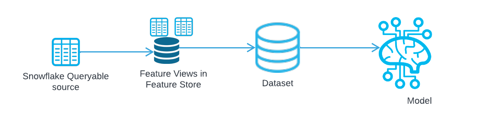

author: Charlie Hammond
id: getting-started-with-ml-lineage
summary: This guide will go through the different features of Snowflake ML Lineage
categories: data-science, data-science-&-ml, Getting-Started, Notebooks
environments: web
status: Published 
feedback link: https://github.com/Snowflake-Labs/sfguides/issues
tags: Getting Started, Data Science 

# Getting Started with ML Lineage
<!-- ------------------------ -->
## Overview 
Duration: 1

ML Lineage lets you trace data as it flows through your machine learning pipeline, from its source, through a feature view, into a dataset, and finally into a model for training. This pipeline is illustrated below.



With ML Lineage, you can understand how machine learning artifacts relate to each other and can answer questions like:
- Where did the data come from to train a particular model?
- What feature views does a particular model depend on?
- What models were trained on data from a given table?

The ML Lineage API is a single function that, given an artifact’s identifying information, looks upstream (to the artifact’s ancestors) and/or downstream (to its descendants) a specified number of steps. The API returns a Snowpark DataFrame containing information about each link between these artifacts, which can then be visualized using graphviz or other tools.

ML Lineage supports the following artifacts:
- Tables and views
- Feature views
- Datasets
- Models

This Quickstart showcases various machine learning workflows, delving into the lineage of each process. It highlights essential features of Snowflake's ML, including [Snowflake Feature Store](https://docs.snowflake.com/en/developer-guide/snowpark-ml/feature-store/overview), [Dataset](https://docs.snowflake.com/en/developer-guide/snowpark-ml/dataset), ML Lineage, [Snowpark ML Modeling](https://docs.snowflake.com/en/developer-guide/snowpark-ml/modeling) and [Snowflake Model Registry](https://docs.snowflake.com/en/developer-guide/snowpark-ml/model-registry/overview). 

### What You Will Learn 
- Learn how to use ML Lineage in Snowflake for artifacts including tables, feature views, datasets, and models.

### What You’ll Need 
- A [Snowflake](https://app.snowflake.com/) Account

### What You’ll Build 
- You will discover ML Lineage for different objects in an ML pipeline

<!-- ------------------------ -->
## Setup Your Account
Duration: 2

Complete the following steps to setup your account:
- Navigate to Worksheets, click "+" in the top-right corner to create a new Worksheet, and choose "SQL Worksheet".
- Paste and the following SQL in the worksheet 
- Adjust <YOUR_USER> to your user
- Run all commands to create Snowflake objects

```sql
USE ROLE ACCOUNTADMIN;

-- Using ACCOUNTADMIN, create a new role for this exercise and grant to applicable users
CREATE OR REPLACE ROLE ML_LINEAGE_ROLE;
GRANT ROLE ML_LINEAGE_ROLE to USER <YOUR_USER>;

-- create our virtual warehouse
CREATE OR REPLACE WAREHOUSE ML_LINEAGE_WH AUTO_SUSPEND = 60;

GRANT ALL ON WAREHOUSE ML_LINEAGE_WH TO ROLE ML_LINEAGE_ROLE;

-- Next create a new database and schema,
CREATE OR REPLACE DATABASE ML_LINEAGE_DATABASE;
CREATE OR REPLACE SCHEMA ML_LINEAGE_SCHEMA;
```

<!-- ------------------------ -->
## Run the Notebook
Duration: 10

- Download the notebook from this [link]()
- Change role to ML_LINEAGE_ROLE
- Navigate to Projects > Notebooks in Snowsight
- Click Import .ipynb from the + Notebook dropdown
- Create a new notebok with the following settings
  - Notebook Location: ML_LINEAGE_DATABASE, ML_LINEAGE_SCHEMA
  - Warehouse: ML_LINEAGE_WH
- Create Notebook
- Click Packages in the top right, add `snowflake-ml-python` and `snowflake-snowpark-python`
- Run cells in the notebook!

<!-- ------------------------ -->
## Conclusion And Resources
Duration: 1

ML Lineage provides a powerful way to trace data throughout your machine learning pipeline, enabling you to understand how different artifacts, such as tables, feature views, datasets, and models, are interconnected. This insight allows you to answer key questions about the origins and dependencies of your models, ensuring transparency and reliability in your ML workflows.

As you dive into Snowflake's machine learning features, such as the Feature Store, Dataset, ML Lineage, Snowpark ML Modeling, and Model Registry, use ML Lineage to strengthen your grasp of data flows. Begin integrating ML Lineage into your workflows now to gain valuable insights and maintain the integrity of your machine learning models.

### What You Learned
- The key features of Snowflake Feature Store including [entities](https://docs.snowflake.com/en/developer-guide/snowflake-ml/feature-store/entities) and [feature views](https://docs.snowflake.com/en/developer-guide/snowflake-ml/feature-store/feature-views).
- How to train a model using [Snowpark ML Modeling](https://docs.snowflake.com/en/developer-guide/snowpark-ml/modeling)
- Learn how to use ML Lineage in Snowflake
- How to log and reference models using [Snowflake Model Registry](https://docs.snowflake.com/en/developer-guide/snowpark-ml/model-registry/overview)

### Related Resources
- [ML Lineage Documentation](https://docs.snowflake.com/LIMITEDACCESS/ml-lineage)